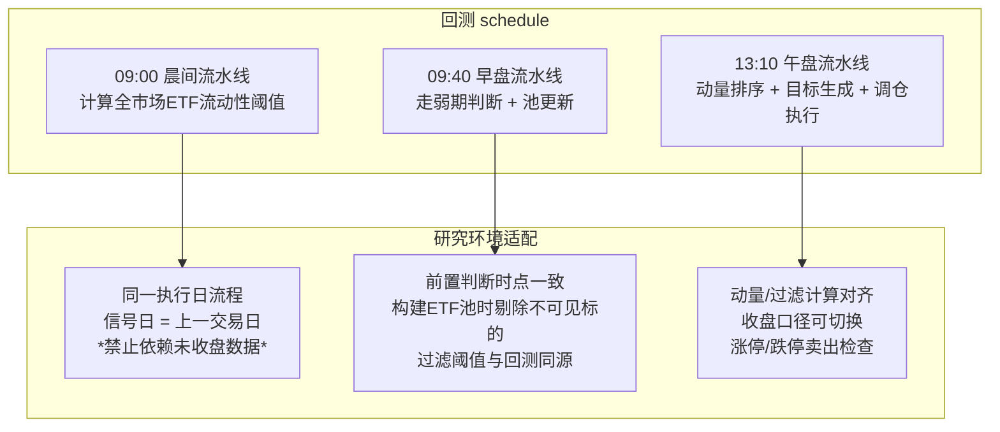

## 一、研究背景：回测“太漂亮”的正反两面

在量化社区，一套高收益低回撤的回测曲线往往令人兴奋，但经验丰富的开发者第一反应通常是：**是否存在未来函数？是否使用了回测当时不可见的信息？**

本次研究的对象是烟花大佬开源的“五福”ETF轮动策略。原版在10年回测中取得了**约83倍（8340%）的总收益、最大回撤仅-20.4%** 的优异表现。但经过严格的“防未来函数”修复后，收益率下降至约44倍（4403%），最大回撤升至-25.1%。

这不意味着策略“变差”了——恰恰相反，**修复后的策略更接近真实可交易环境的表现**，那些被剔除的“超额收益”本质上是不可复现的历史偏差。

## 二、三层修改思路

整个修复方案围绕三层防御体系展开：

### 第一层：防穿越

防止“回测当天看到了未来上市的ETF”以及“用到当天尚未收盘的数据”导致结果偏乐观。典型问题包括：

当前全量ETF名单在回测历史年份仍然可用，但那些ETF在当时可能尚未上市（幸存者偏差）；动量排序与弱势判断混入了盘中实时数据，而回测引擎在部分接口上会“偷带”全天信息。

### 第二层：统一时间基准

将所有选池构建、弱势判断、动量排序、溢价率计算等全部绑定到**信号日**（上一完整交易日），保证同一时点的信息一致性。回测里“今天13:10做决策”和“今天09:40做走弱判断”存在时序差异，研究环境与回测环境的时间序列对齐问题是最大的坑。

### 第三层：保留实盘灵活性

通过开关参数让策略在“保守日线口径（适合回测验证）”和“实时盘中口径（适合实盘决策）”之间切换，而非一刀切地禁用实时数据。核心思想是：**信号慢变量（前收口径） + 风控快变量（实时止损）** 是不冲突的组合。

## 三、关键修复项及影响

### 3.1 ETF可见性过滤

**改动**：新增`get_visible_etf_pool()`函数，按信号日过滤ETF池，剔除当时尚未上市的标的；`get_all_securities(['etf'])`改为`get_all_securities(['etf'], date=signal_date)`，在固定池、全球池、动态池、动量排序等多处调用。

**影响**：这是收益下降的最主要贡献因素。以2026年1月21日为例，研究环境回放显示走弱期全球池从原版的17只变为15只，剔除了2只未来/不可见标的；带历史日期口径后，动态池中每个行业组选出的最高流动性ETF也可能发生变化，历史上存在但后来退市的弱势ETF被纳入候选集。

### 3.2 信号日统一与动量口径切换

**改动**：新增`get_signal_date(context)`函数，统一定义“信号计算能看到的最新完整交易日”；动量计算通过`g.use_previous_close_for_signal`开关，支持两种口径：前收口径用历史序列最后一根收盘价；实时口径用`hist_closes + current_data.last_price`拼接。成交量计算通过`g.use_intraday_volume_projection`开关，支持两种口径：保守模式用前一日成交量 / 过去N日均量；盘中外推模式用`today_vol * (240 / elapsed_minutes) / avg_volume`。

**影响**：这两个开关设为`False/True`时，核心交易信号可基本回退到原版口径，但ETF可见性修复和走弱口径修复仍会改变回测曲线。

### 3.3 走弱期判断修正与回滚

**改动**：走弱状态机判断从`attribute_history()`改为`get_price(..., end_date=signal_date)`，以便更精确控制数据时点。

**关键发现——回滚测试**：当我们在研究环境中将代码回滚到`attribute_history()`口径后，发现研究环境与回测环境在`attribute_history`的行为上存在根本差异。回测引擎在研究环境的`attribute_history`中，日线最后一根可能是“含当日未收盘数据的K线”，导致信号日被错误前移。例如，回测在2026年1月21日09:40用沪深300的**1月20日收盘4718.88**判断走弱（3/4低于MA10，进入走弱期）；而研究环境在13:10用`attribute_history`，末根K线变成了**1月21日收盘4871.91**，4/4站上MA10，判为正常期。这种差异直接导致回测走弱期用15只全球池（最终触发防御买入银华日利），而研究版用141只合并池（继续持有科创板50）。

**最终方案**：将走弱判断的数据获取改为`get_price(..., end_date=signal_date)`加研究兼容兜底函数，确保两个环境使用完全相同的信号日数据窗口。同时，由于研究版触发点修改，对应的指数数据由之前的偏高（含当日）恢复至与回测一致（纯历史）。

### 3.4 下单执行限制

**改动**：这是执行层面而非信号层面的问题。回测版`smart_order_target_value`中，当标的处于涨停/跌停状态时会跳过交易，而研究版的`_rebalance_to_target`早先没有复刻这一限制。

**典型案例**：2026年3月2日，信号日已正确设为2月27日。研究环境的目标持仓计算结果为“日经ETF”，计划卖出“油气ETF”。油气当日价格**1.261**触及涨停价，回测版正确阻止了卖出和后续的买入，而研究版未经此限制，直接卖出了油气并买入日经。这导致研究显示3月2日即换仓，而回测中油气继续持有至3月4日才换为黄金。

**修复后**：在研究版调仓函数中增加涨停/跌停/停牌检查，卖出失败时保留原持仓，买入阶段按实际持仓数判断是否还能买入新目标。

## 四、研究方法：回测-研究对照流水线

本次研究的关键方法论突破，在于构建了一套**回测-研究环境对照流水线**。这不仅仅是代码对齐，更是对量化研究过程中信息一致性问题的系统化梳理。

### 4.1 时序对齐策略

图1展示了回测与研究的时序一致性要求：



回测中走弱判断只在**09:40**跑一次，池更新随之完成；**13:10**不再重新判断走弱，只沿用09:40的状态。因此研究环境也必须按09:00→09:40→13:10的时序分段运行，而不能把所有逻辑堆在13:10一次性执行。为此，研究版实现了`run_full_daily_strategy_pipeline`函数，按回测的时间节点依次执行各阶段逻辑，确保与回测行为一致。

### 4.2 信号日解析稳定性

在研究环境中，**`get_trade_days(end_date=当日, count=N)`的行为与回测环境不一致**是最隐蔽的坑。该函数在某些情况下返回的顺序不一定与回测相同，且`count`参数的含义在不同环境下可能有差异（是“截至end的最后N天”还是“从数据起点数N根”）。为了规避此问题，研究版经历了多次迭代：从最初的`td[0]`假设前一个是上一日，到显式截取日历窗口内的交易日列表，到最终方案——由回放循环直接传入上一个交易日作为`signal_date`。

```python
for idx, trade_date in enumerate(days_list):
    signal_date = days_list[idx - 1] if idx > 0 else None
    run_full_daily_strategy_pipeline(context, trade_date, signal_date=signal_date)
```

这样彻底绕过了对聚宽接口语义的依赖，保证了信号日解析的确定性。

### 4.3 状态持续性验证

回测中`g.is_a_share_weak`、`g.merged_etf_pool`、`g.filtered_global_pool`等状态在一天内只设定一次，后续不再变更。研究环境需要模拟这一状态持续性，确保13:10使用的池子正是09:40构建的结果，而非13:10重新计算得到的（可能不同的）结果。研究版通过将走弱判断和池构建放在09:40阶段，在13:10阶段直接使用已构建的池子，保证了这一点。

## 五、回测性能变化与对照分析

| 综合指标 | 原版 | 修复版 |
|---------|------|--------|
| 10年总收益 | ~8340% | ~4403% |
| 最大回撤 | ~-20.4% | ~-25.1% |

**差异来源归因**：
1. **ETF可见性过滤**：过去十年的候选池中，删除了若干只在回测区间末尾才出现的标的，历史穿越收益被剔除。当候选池变化，特定日期的目标ETF也不同。
2. **走弱期进入时机**：原版在09:40用`attribute_history`，某些边界日期（指数刚好在MA10上下）的走弱/正常判定存在偏差，可能导致防守切换的节奏变化。
3. **下单执行细化**：研究对照中发现的涨停/跌停限制，说明部分回测超额可能来自“看似成交、实盘无法执行”的场景，修复后收益回调也是合理现象。

虽然收益率下降、回撤率升高，但**修复后的曲线更接近真实可交易环境**。这并不意味着策略失效——44倍10年收益依然是非常优秀的策略表现，而更高的可信度意味着实盘部署时不会出现大幅偏差。

## 六、总结与展望

### 核心收获

1. **未来函数不是非黑即白**。用实时价和盘中量做13:10决策**不是未来函数**（只要数据确实截至当时可见），但把动量排序全部绑在“上一交易日收盘口径”上，回测/实盘一致性更高。两套口径通过开关保留而非互斥，是最务实的设计。

2. **聚宽回测与研究环境的行为差异需要主动验证**，不能假设同一段代码在两个环境下跑出来的结果一致。`get_trade_days`的排序语义、`attribute_history`的日线截止规则、`get_all_securities`的历史日期支持，都可能在研究环境下产生不同结果。

3. **执行层面与信号层面同等重要**。3月2日油气因涨停无法卖出、因此继续持有至3月4日的案例，说明“目标持仓”不等于“实际持仓”，**下单限制是策略回测的最后一道防线**，如果研究版忽略它，整个对照结果就会偏离。

4. **参数不是越多越好**。原版V5.0中25日动量、R²>0.4、量比<1.8、MA10、3日跌幅等多重硬阈值参数，如果缺乏滚动样本外验证，极易把历史行情特征拟合进去。修复未来函数只是第一步，后续参数鲁棒性测试和分市场阶段验证同样是重要方向。

### 下一步方向

- 对过滤参数进行**滚动窗口优化**与**样本外验证**，避免过度依赖固定阈值
- 将选池、打分、过滤、下单**拆分为可独立测试的纯函数**，降低耦合度
- 增加完整的信号落盘日志，记录每只ETF被淘汰的具体原因
- 分市场阶段（牛市/熊市/震荡）验证参数稳定性

---

> **致谢**：本文基于烟花大佬开源的五福策略代码进行分析与优化，感谢开源社区的知识分享。研究过程中的关键讨论由 AI 辅助完成策略对比、逻辑梳理、代码修改和问题定位。

---

*以上内容为个人研究记录，不构成任何投资建议。量化有风险，实盘需谨慎。*
